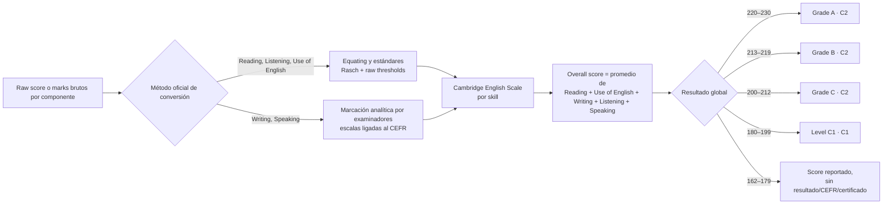

# Equivalencias oficiales del C2 Proficiency a la Cambridge English Scale

## Resumen ejecutivo

La documentación oficial de Cambridge no publica, para **C2 Proficiency**, una tabla completa “acierto por acierto” que convierta **cada raw score** de cada componente en **cada punto exacto** de la Cambridge English Scale. Lo que sí publica son **umbrales oficiales** para tests oficiales de práctica: la raw score necesaria para llegar a **162, 180, 200 y 220** en cada componente reportado. A partir de esos umbrales se puede reconstruir, con seguridad lógica pero **no como tabla oficial exacta**, qué **rangos de raw score** caen en las bandas **162–179**, **180–199**, **200–219** y **220+**. citeturn10view0turn12view0turn4view0

En el examen real, Cambridge reporta **cinco puntuaciones individuales**: **Reading, Use of English, Writing, Listening y Speaking**. La **puntuación global** se calcula promediando esas cinco puntuaciones y redondeando al entero más cercano. El **grade** y el **nivel CEFR/MCER** se asignan **solo al resultado global**, no a cada skill por separado. Además, Cambridge deja claro que **no hace falta “aprobar cada paper”**: lo decisivo es el promedio final. citeturn2view2turn10view0turn17view0

Para el resultado global de C2 Proficiency, Cambridge establece estas bandas oficiales: **220–230 = Grade A (C2)**, **213–219 = Grade B (C2)**, **200–212 = Grade C (C2)**, **180–199 = Level C1 (C1)**; entre **162 y 179** la puntuación se reporta, pero **no** se concede resultado, nivel CEFR ni certificado; por debajo de **162** no se informa puntuación para este examen. citeturn2view4turn17view0turn18view0

También conviene corregir una simplificación frecuente: en la documentación oficial no he encontrado que Cambridge presente Proficiency como una escala “**0–230**”. Para las Cambridge English Qualifications, Cambridge publica la **Cambridge English Scale** como una escala más amplia, y para **C2 Proficiency** el rango **reportado** es **162–230**. Los documentos oficiales sobre esta conversión detallada, además, están disponibles sobre todo **en inglés**, aunque Cambridge sí ofrece páginas de resultados y de explicación general en español. citeturn18view0turn2view4turn14search3

## Sistema oficial de puntuación del C2 Proficiency

El formato actual del examen es el mismo en **digital** y en **paper-based**. C2 Proficiency tiene cuatro componentes, pero el resultado se reporta en **cinco scores** porque el **Paper 1** se desdobla en **Reading** y **Use of English**. El formato oficial actual es: **Reading and Use of English** (7 partes / 53 preguntas), **Writing** (2 partes), **Listening** (4 partes / 30 preguntas) y **Speaking** (3 partes). citeturn6view0turn7view0

La lógica oficial de cálculo es esta: Cambridge obtiene una puntuación por **Reading**, otra por **Use of English**, otra por **Writing**, otra por **Listening** y otra por **Speaking**; después calcula el **overall score** como la media de esas cinco puntuaciones y redondea al entero más cercano. El grade y el nivel CEFR se basan en ese promedio global. citeturn2view2turn10view0turn17view0



El desglose oficial de cómo se forman las **raw scores** por componente es el siguiente:

| Score reportado por Cambridge | Cómo se forma la raw score oficial | Máximo bruto |
|---|---|---:|
| Reading | Partes 1, 5, 6 y 7 del Paper 1 | 44 |
| Use of English | Partes 2, 3 y 4 del Paper 1 | 28 |
| Writing | 2 tareas, 20 marks cada una | 40 |
| Listening | 30 preguntas, 1 mark cada una | 30 |
| Speaking | Criterios del assessor + Global Achievement del interlocutor | 75 |

En **Reading**, las Partes 1 y 7 valen **1** mark por respuesta correcta y las Partes 5 y 6 valen **2**; en total, **44**. En **Use of English**, las Partes 2 y 3 valen **1** mark cada una, y en la Parte 4 una respuesta parcialmente correcta vale **1** y una completamente correcta vale **2**; en total, **28**. En **Writing**, cada tarea se puntúa con cuatro criterios de **0–5**, sin medios puntos, hasta **20** por tarea y **40** en total. En **Listening**, cada respuesta correcta vale **1**, hasta **30**. En **Speaking**, el assessor da **0–5** en cinco criterios, esos marks se doblan, el interlocutor da **0–5** en **Global Achievement** y ese mark se multiplica por **5**; se permiten **half marks** y el total máximo es **75**. citeturn7view0turn12view0turn3view1turn3view2turn3view3

La tabla oficial del resultado global queda así:

| Puntuación global en la Cambridge English Scale | Resultado global | Nivel MCER |
|---|---|---|
| 220–230 | Grade A | C2 |
| 213–219 | Grade B | C2 |
| 200–212 | Grade C | C2 |
| 180–199 | Level C1 | C1 |
| 162–179 | Sin resultado / sin nivel / sin certificado | No especificado |
| <162 | No reportado | No especificado |

Esta tabla es oficial para el **resultado global**. Cambridge también deja claro que las puntuaciones individuales por skill aparecen en el Statement of Results, pero el **grade** y el **CEFR level** formales son del **examen global**. citeturn2view4turn17view0

## Tablas de equivalencia publicadas y bandas derivadas

Cambridge publica para C2 Proficiency, en sus hojas de conversión de práctica, los **umbrales de raw score** necesarios para alcanzar **162, 180, 200 y 220** en cada componente reportado. Esas tablas se aplican **solo a official Cambridge practice tests** y Cambridge advierte expresamente que **no deben usarse para predecir puntuaciones exactas del examen real**. citeturn10view0turn4view0

La siguiente tabla resume los **umbrales oficiales publicados**:

| Componente reportado | 162 en Scale | 180 en Scale | 200 en Scale | 220 en Scale |
|---|---:|---:|---:|---:|
| Reading | 14 | 22 | 28 | 36 |
| Use of English | 9 | 13 | 17 | 22 |
| Writing | 10 | 16 | 24 | 34 |
| Listening | 10 | 14 | 18 | 24 |
| Speaking | 17 | 30 | 45 | 66 |

La hoja específica de **C2 Proficiency** y la guía general más reciente de Cambridge reproducen los mismos umbrales para estos cinco componentes. citeturn4view0turn12view0

A partir de esos umbrales oficiales, puede construirse la siguiente tabla de **bandas de raw score**. **Importante**: esta tabla de bandas es una **inferencia estrictamente monotónica** a partir de los puntos oficiales publicados; **no** es una tabla oficial “marca exacta → punto exacto”. Sí permite saber, con base oficial, en qué **franja** de la Cambridge English Scale cae una raw score de un **official Cambridge practice test**.

| Componente reportado | Raw score que cae por debajo de 162 | Raw score en banda 162–179 | Raw score en banda 180–199 | Raw score en banda 200–219 | Raw score en banda 220+ |
|---|---|---|---|---|---|
| Reading | 0–13 | 14–21 | 22–27 | 28–35 | 36–44 |
| Use of English | 0–8 | 9–12 | 13–16 | 17–21 | 22–28 |
| Writing | 0–9 | 10–15 | 16–23 | 24–33 | 34–40 |
| Listening | 0–9 | 10–13 | 14–17 | 18–23 | 24–30 |
| Speaking | 0–16.5 | 17–29.5 | 30–44.5 | 45–65.5 | 66–75 |

La última columna debe leerse con una precaución adicional: Cambridge publica el **umbral para llegar a 220**, pero **no publica el punto exacto** dentro de la banda **220–230** para cada raw score superior a ese umbral. Por eso la columna dice **220+**. Sabemos, por la documentación del examen, que Proficiency reporta dentro del rango **162–230**, pero no hay tabla oficial pública que diga, por ejemplo, si **Reading 40/44 = 224, 226 o 228**. Lo mismo vale para **Writing**, **Listening**, **Speaking** y **Use of English**. citeturn18view0turn10view0turn4view0

También conviene leer correctamente la banda **162–179**. En las tablas de práctica, Cambridge marca **162** con un guion en la columna CEFR, no con **C1** ni con **C2**. En el examen real, una puntuación global en **162–179** se reporta, pero **no** genera resultado, nivel CEFR ni certificado. Para los skills individuales, Cambridge sí reporta la puntuación numérica, pero el CEFR y el grade oficiales siguen siendo globales, no por skill. citeturn4view0turn17view0

Si el interés es el **Paper 1 completo** como unidad administrativa del examen, hay que subrayar una limitación importante: Cambridge **no** publica una conversión oficial única para el total combinado del **Reading and Use of English paper**. Publica la conversión por **Reading** y por **Use of English**, porque ésos son los scores que luego aparecen por separado en el Statement of Results. citeturn17view0turn2view2

## Método de inferencia y datos no especificados

La metodología oficial no es la misma para todos los componentes. En **Reading**, **Listening** y **Use of English**, Cambridge usa componentes objetivamente corregidos y aplica **Rasch analysis** para mantener un estándar consistente entre formularios, calibrando la dificultad de los ítems y determinando qué raw marks corresponden a niveles de habilidad predefinidos. En **Writing** y **Speaking**, la puntuación procede de **escalas analíticas ligadas al CEFR** aplicadas por examinadores entrenados y estandarizados; el total de marks de cada componente se convierte luego en una puntuación de la Cambridge English Scale. citeturn9view0

Eso tiene una consecuencia práctica: Cambridge **no publica** una tabla oficial exhaustiva “raw score exacta → Cambridge Scale exacta” para cada componente. Publica, en cambio, los **thresholds** necesarios para alcanzar determinados puntos de la escala en **official practice tests**. Por tanto, lo que puede afirmarse con rigor es lo siguiente: si una raw score cae entre el umbral de **180** y el umbral de **200**, entonces pertenece a la **banda 180–199**; si cae entre el umbral de **200** y el de **220**, pertenece a la **banda 200–219**; si supera el umbral de **220**, pertenece a la banda **220+** dentro del rango reportado por Proficiency. El punto exacto dentro de cada banda es **no especificado** por Cambridge en acceso público. citeturn10view0turn12view0turn9view0

Un ejemplo sencillo lo deja claro. En **Listening**, Cambridge publica los umbrales **14 → 180**, **18 → 200** y **24 → 220**. Por tanto, una raw score de **16** en un official practice test se puede ubicar con seguridad en la banda **180–199**, es decir, **franja C1** en la tabla de práctica; pero Cambridge **no publica** si ese **16** exacto equivale a **186**, **191** o **198**. Del mismo modo, una raw score de **25** en Listening está por encima del umbral de **220**, así que cae en **220+**, pero Cambridge no publica el valor exacto dentro de la banda alta. citeturn4view0turn10view0

En **Speaking**, la situación es todavía menos reducible a “número de aciertos”, porque no existen aciertos objetivos. Lo que existe es una **suma de marks** de criterios: **Grammatical Resource, Lexical Resource, Discourse Management, Pronunciation, Interactive Communication** y **Global Achievement**, con **half marks** permitidos. Por eso, para Speaking, hablar de “aciertos” no es técnicamente correcto; lo correcto es hablar de **marks brutos** o **total mark del componente**. citeturn3view3turn12view0

Lo mismo vale para **Writing**: tampoco hay “aciertos” en sentido objetivo, sino **marks** dados por examinadores en **Content, Communicative Achievement, Organisation y Language**, con valores enteros de **0 a 5** por criterio y por tarea. Cambridge publica el total del paper (**40**), pero **no** publica una conversión oficial separada de **Writing Part 1** y **Writing Part 2** a la Cambridge English Scale, ni una tabla exhaustiva por total bruto exacto. citeturn3view1turn12view0

Hay además un matiz crucial para no sobrerreconstruir lo que Cambridge no publica: en la guía general de conversión, Cambridge advierte que los scores necesarios para alcanzar ciertos puntos de la Cambridge English Scale **varían** por múltiples factores, y recomienda cautela especialmente en torno a los límites, aproximadamente **±3 puntos** de Cambridge English Scale alrededor del umbral de nivel. Traducido: una raw score cerca del límite en un practice test no garantiza que el candidato alcanzaría ese mismo nivel en un examen real distinto. citeturn10view0

En consecuencia, estos son los datos que deben marcarse como **no especificado** en un informe riguroso:

| Dato | Estado en fuentes oficiales de Cambridge |
|---|---|
| Conversión exacta de cada raw score de Reading a cada punto de la Scale | No especificado públicamente |
| Conversión exacta de cada raw score de Use of English a cada punto de la Scale | No especificado públicamente |
| Conversión exacta de cada total bruto de Writing a cada punto de la Scale | No especificado públicamente |
| Conversión exacta de cada total bruto de Speaking a cada punto de la Scale | No especificado públicamente |
| Conversión del total combinado del Paper 1 completo a un único score | No especificado; Cambridge reporta Reading y Use of English por separado |
| Conversión por subparte interna del examen | No especificado públicamente |

La única inferencia que aquí he usado es ésta: **entre dos umbrales oficiales publicados, la raw score pertenece a la banda de Cambridge Scale delimitada por esos umbrales**. No he inferido ninguna escala punto a punto dentro de la banda, porque Cambridge no la publica. citeturn10view0turn12view0turn17view0

## Variaciones por versión, fecha y URLs oficiales exactas

Hay tres advertencias históricas y documentales que importan. La primera es que **Proficiency reporta en la Cambridge English Scale desde enero de 2015**; los resultados **pre-2015** se informaban con **standardised score** y **candidate profile**, así que las tablas antiguas no son directamente equivalentes a las actuales. citeturn8view0turn18view0

La segunda es que el **formato actual** del examen —incluido el desglose del Paper 1 en Reading y Use of English, y el reparto actual de preguntas/marks— es el que figura en la página oficial de formato y en el handbook vigente; además, Cambridge afirma que el formato es el mismo para las versiones **digital** y **paper-based**. citeturn6view0turn7view0turn2view2

La tercera es que las tablas de raw score que Cambridge publica son de **orientación para official Cambridge practice tests**. De hecho, la hoja específica de **C2 Proficiency** de **2019** y la guía general de **2023** coinciden en los umbrales de C2 Proficiency, lo que sugiere estabilidad documental reciente; pero Cambridge mantiene la advertencia de que esto **no equivale** a una predicción exacta del examen real. citeturn4view0turn12view0turn10view0

En español sí existen páginas oficiales de resultados y de explicación general de la escala, pero esas mismas páginas remiten al detalle técnico y a las guías de conversión **“en inglés”**. Por eso, para la parte verdaderamente técnica de las equivalencias raw score → Scale, la documentación oficial clave que he podido localizar está en inglés. citeturn2view4turn14search3

Las **URLs exactas** oficiales utilizadas para este informe son éstas:

```text
https://www.cambridgeenglish.org/es/exams-and-tests/proficiency/results/
https://www.cambridgeenglish.org/es/exams-and-tests/cambridge-english-scale/
https://www.cambridgeenglish.org/exams-and-tests/qualifications/proficiency/format/
https://www.cambridgeenglish.org/Images/168194-c2-proficiency-teachers-handbook.pdf
https://www.cambridgeenglish.org/Images/210434-converting-practice-test-scores-to-cambridge-english-scale-scores.pdf
https://www.cambridgeenglish.org/fr/Images/646305-c2scale.pdf
https://www.cambridgeenglish.org/images/177867-the-methodology-behind-the-cambridge-english-scale.pdf
https://www.cambridgeenglish.org/es/Images/664447-c2-statement-of-results-factsheet.pdf
https://www.cambridgeenglish.org/images/167506-cambridge-english-scale-factsheet.pdf
```

Si se resume todo en una sola frase técnicamente defensable, sería ésta: **Cambridge publica para C2 Proficiency umbrales oficiales por componente para alcanzar 162, 180, 200 y 220 en official practice tests, pero no publica una tabla pública completa de conversión exacta raw score → Cambridge English Scale para cada mark posible; por tanto, solo pueden establecerse con seguridad oficial esas bandas, no equivalencias punto a punto.** citeturn10view0turn12view0turn9view0